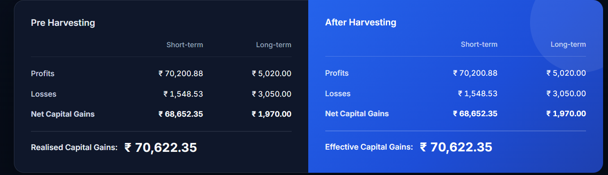
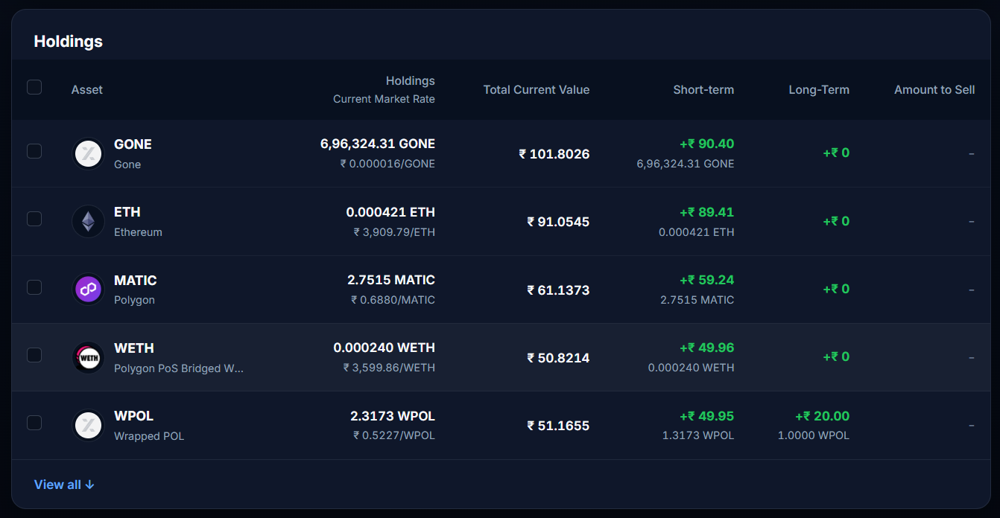
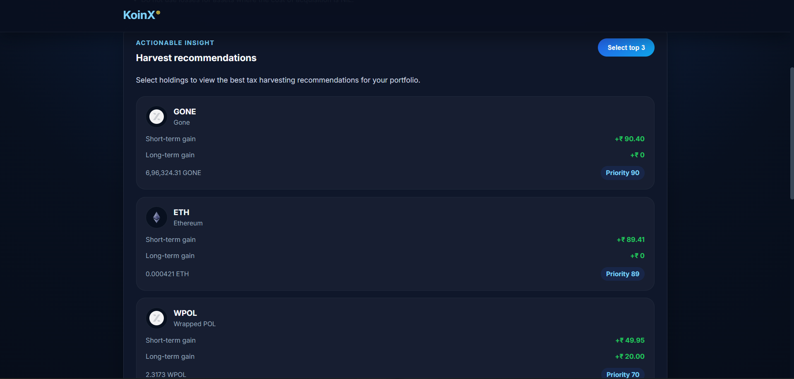

 SuperX  Tax Loss Harvesting Tool

A responsive React + TypeScript dashboard for crypto tax harvesting, built as a KoinX frontend assignment.

 🚀 Live Demo

     https://superx-two.vercel.app/

 ✨ Features

- ✅ **Interactive holdings table** with row selection and checkbox controls
- ✅ **Capital gains dashboard** showing Pre- and After-Harvesting results
- ✅ **Tax savings indicator** when harvesting reduces realised gains
- ✅ **Select All / Deselect All** support with indeterminate state
- ✅ **View All toggle** to expand/collapse the holdings list
- ✅ **Loading skeletons** while mock data loads
- ✅ **Error state** with retry button
- ✅ **Mobile-friendly design** with responsive layout
- ✅ **TypeScript + Vite** for a modern frontend setup

 🛠️ Setup Instructions

 Prerequisites

- Node.js 18 or newer
- npm 9 or newer

 Install and run locally

```bash
cd "C:\Users\Sujal\Downloads\koinx-tlh"
npm install
npm run dev
```

Open `http://localhost:5173` in your browser.

 Build for production

```bash
npm run build
```

 Preview production build

```bash
npm run preview
```

 📁 Project Structure

```
src/
├── api/
│   ├── capitalGainsApi.ts   # Mock capital gains API
│   └── holdingsApi.ts       # Mock holdings API
├── components/
│   ├── CapitalGainsCards/   # Pre & After Harvesting summary cards
│   ├── Disclaimer/          # Collapsible notes and assumptions
│   ├── Header/              # Application header and branding
│   └── HoldingsTable/       # Interactive holdings table UI
├── context/
│   └── HarvestingContext.tsx  # Global state management
├── types/
│   └── index.ts             # Data model definitions
├── utils/
│   └── formatters.ts        # Currency and number formatting
├── App.tsx
├── App.css
├── index.css
└── main.tsx
```

 🖼️ Screenshots

The app screenshots are added under `screenshots/`.








 🧮 Assumptions

- Holdings are displayed in Indian Rupees (`₹`)
- `Total Current Value` is calculated as `currentPrice * totalHolding`
- When a holding is selected, the full `totalHolding` is considered sold
- The savings banner appears only when after-harvest realised gains are lower than pre-harvest realised gains
- Recommendation logic prioritises holdings by the absolute size of STCG and LTCG impact

   Mock API behavior

- `fetchCapitalGains()` returns mock STCG and LTCG data after a short delay
- `fetchHoldings()` returns mock holdings data after a short delay
- Data is sorted by absolute short-term gain impact before render

 🚀 Deployment

 GitHub Pages

```bash
npm run build
# then deploy the contents of dist/ to GitHub Pages or another static host
```

 Vercel

```bash
npm install -g vercel
vercel --prod
```

 Netlify

```bash
npm run build
# drag & drop dist/ into the Netlify site deploy interface
```

## 📌 Notes

- The app is intentionally built with vanilla CSS and no external UI framework
- The primary focus is on tax harvesting UX and interactive selection behavior
